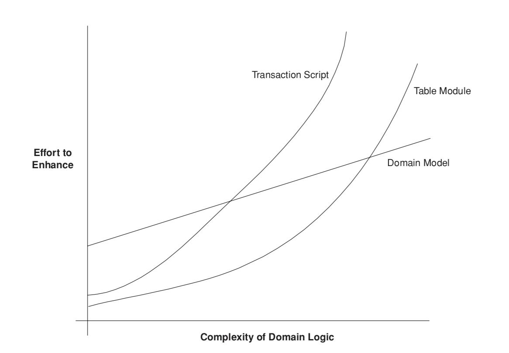

Domain Logic Pattern
--------------------

여기에서 도메인 로직 구성은 크게 3가지로 나누어서 진행할 예정인다.
각각은 아래와 같다.
::

  1) Transaction Script
  2) Domain Model
  3) Table Module

Transaction Script
------------------

트랜잭션 스크립트 패턴은 아래와 같은 구조를 갖게 된다. 

  | Input(Service Layer) -> Validation & Calulation(Domain Layer) -> Store Data(Data Source Layer) or Invoke Other system

장점
::

  1) 대부분 개발자가 이해하는 간단한 프로시져 모델 형태로 됨
  2) Row Data Gateway or Table Data Gateway와 연동되는 간단한 모델이 생성가능함
  3) 트랜잭션 바운더리를 지정하기 쉬움

단점
::

  1) 도메인 복잡성이 높아질 수록 복잡도가 증가함
  2) 공통적인 서브루틴의 개념으로 중복되는 부분을 줄이고 잇지만 중복되는 소스를 제거하는 것이 쉽지 않음
  3) 분명한 구조 없이는 얽키고 설킨 구조가 되기 쉬움

Domain Model
------------

도메인 로직과 Transactional Script의 차이점은 동일한 로직이 흘러가는 것을 보이지만 
Domain Logic은 Object 사이의 relation 과 responsibility에 대한  통하여 이루어지는 것을 의미한다.

  | Input(Service Layer) -> A Object(Domain Layer) -> B Object(Domain) -> Strategy Pattern Object(Domain) -> Store Data(Data Source Layer) or Invoke Other system

.. note::  
  만약, 도메인 모델이 DB와 1:1관계를 갖게된다면 Active Record 모델을 사용하면 된다.

Table Module
------------

Table Module은 Domain Model과 비슷해 보인다. 하지만 Domain Model은 한 인스턴스 당 데이터 베이스 aggregate와 일치하지만,
Table Model은 Record Set 즉 여러개의 인스턴스를 다루는 것을 목적으로 한다.

Complexity
-----------

아래 그림은 어떤 도메인 로직을 선택하느냐에 따라 달라지는 비용에 대한 그림이다. 
프로젝트가 진행되면 될수록 복잡성이 올라가게 된다면 적당한 모델을 잘 선택할 필요가 있다. 하지만 이런 수치는 정량적으로 파악하기 힘드므로 
이를 개선하기 위해서는 좀 더 신중하게 도메인을 이해할 필요가 있다.

